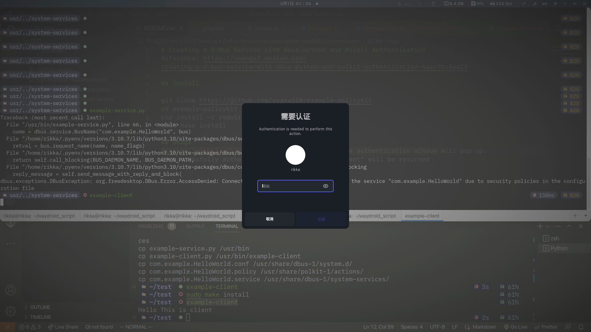
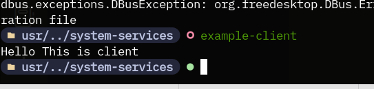

# Creating a D-Bus Service with dbus-python and Polkit Authentication
Reference: https://vwangsf.medium.com/creating-a-d-bus-service-with-dbus-python-and-polkit-authentication-4acc9bc5ed29

## Install
```
git clone https://github.com/ayasa520/example-policykit
cd example-policykit
pip install -r requirements.txt
sudo make install
```
## Usage
Execute `example-client` in the terminal, then the authentication window will pop up.
If successfully authenticated, "Hello This is client" will be returned




